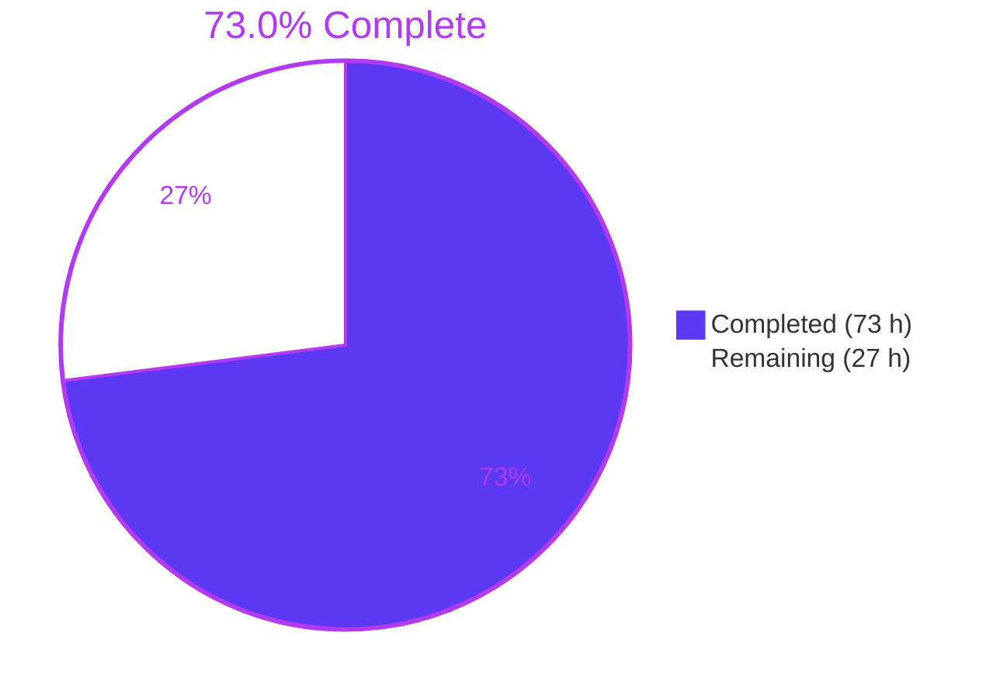
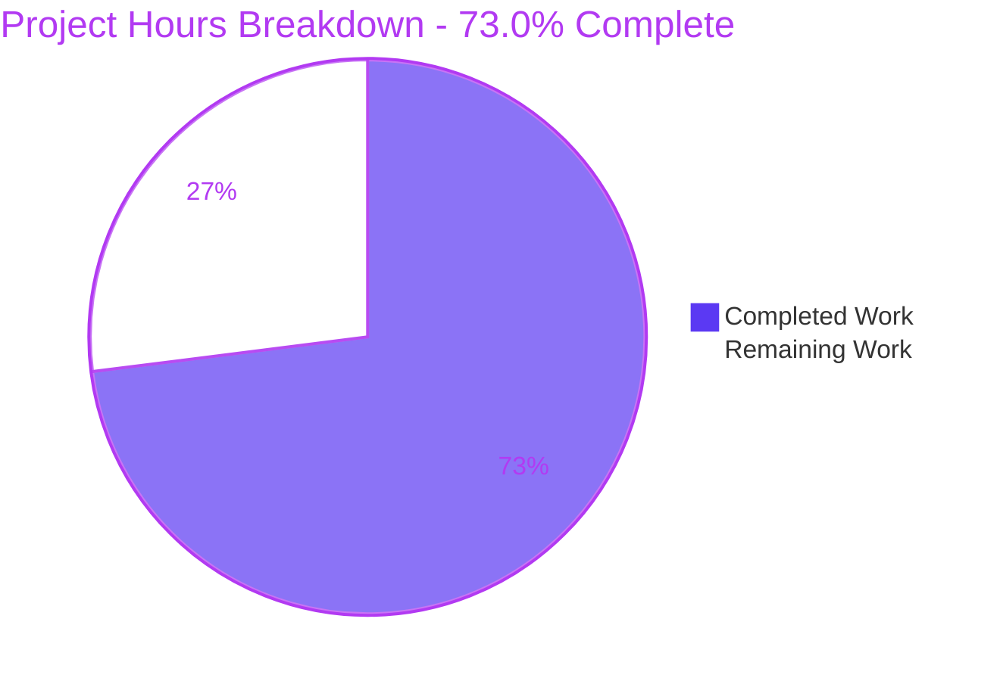
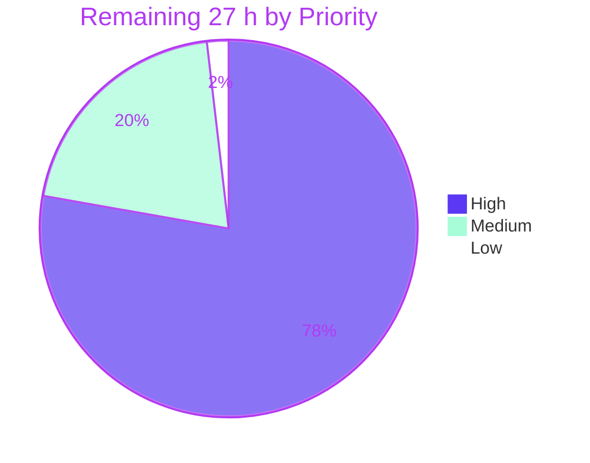

# Blitzy Project Guide

**Project:** Redis — release of inherited client socket descriptors in persistence fork children
**Branch:** `blitzy-5756bffa-0a85-4084-a7ac-9ddf6871cf28` · **HEAD:** `9be5fd3d3` · **Base:** `8b6b331a0`
**Change footprint:** 5 files · 171 insertions · 0 deletions · 9 commits
**Assessment basis:** AAP-scoped (PA1) hours methodology, independently re-verified in this container

---

## 1. Executive Summary

### 1.1 Project Overview

Redis background persistence children (BGSAVE and AOF rewrite) inherited a duplicate of every accepted client socket from `fork()` and never released it. Because the kernel tears a TCP connection down — and emits the FIN — only on the *last* close, a client the parent had already reaped stayed alive, pinned by the child, for the entire save: no FIN, peer sockets stuck ESTABLISHED, and pooled clients writing successfully then hanging until their own read timeout. This work completes `closeChildUnusedResourceAfterFork()`, whose documented charter already covered exactly this, by releasing inherited client descriptors in RDB and AOF children while preserving the replica connections and pipes those children legitimately use. Beneficiaries are operators of connection-pooled deployments that set a non-zero `timeout`.

### 1.2 Completion Status



| Metric | Value |
|---|---|
| **Total Hours** | **100.0 h** |
| **Completed Hours (AI + Manual)** | **73.0 h** (AI 73.0 + Manual 0.0) |
| **Remaining Hours** | **27.0 h** |
| **Percent Complete** | **73.0%** |

Calculation (PA1): `73.0 / (73.0 + 27.0) x 100 = 73.0%`.

Legend — <span style="color:#5B39F3">**Completed / AI Work = Dark Blue `#5B39F3`**</span> · **Remaining = White `#FFFFFF`**.

All 27.0 remaining hours are **human-gated review and platform-gated validation**. None is rework, defect debt, or unfinished implementation: every one of the 23 AAP-specified deliverables is complete and independently verified.

### 1.3 Key Accomplishments

- [x] **Root cause corrected at its single site.** `closeChildUnusedClientSockets()` added to `src/networking.c` (+37), a purpose-gated call added inside `closeChildUnusedResourceAfterFork()` in `src/server.c` (+13), and the cross-translation-unit prototype added to `src/server.h` (+1).
- [x] **Scope discipline is exact.** `git diff 8b6b331a0 HEAD --numstat` = **171 insertions / 0 deletions across exactly the 5 AAP files**; post-change line counts 5787 / 4487 / 8050 / 517 / 953 match the AAP targets byte-for-byte. All 18 explicitly excluded files are untouched.
- [x] **The pre-existing mitigation was preserved verbatim**, as AAP 0.6.2 requires — 0 deletions anywhere in the diff — so the bounded post-fork window remains covered.
- [x] **A genuine regression detector, not a tautology.** I reverted only the three source edits in a throwaway copy and the new test failed with exactly the AAP-predicted diagnostic `BGSAVE child exited while still holding the client socket`, with all 13 sibling assertions still green.
- [x] **Side-by-side descriptor-level proof reproduced by me.** Baseline: `sockets referenced ONLY by child: ['socket:[500137576]', 'socket:[500137580]']` and `FIN-WAIT-2 ... users:(("redis-server",pid=2361932,fd=12))`. Fixed: no process retains the socket, peer read returns **0 bytes = EOF** while `rdb_bgsave_in_progress:1`, and `rdb_last_bgsave_status:ok` with `dbsize=10000`.
- [x] **The protected boundary holds.** Diskless full sync served directly by the RDB child completes with matching `debug digest` across all three replication modes; removing only the `CLIENT_SLAVE` guard breaks synchronisation, proving the exclusion is load-bearing.
- [x] **All five AAP-specified test configurations executed by me personally** — `unit/networking` plain / TLS / `io-threads 4` (14 ok each) and `integration/replication-rdbchannel` plain / TLS (22 ok each), every run exit 0.
- [x] **Warning-free under the project's own CI recipe.** `make -j4 REDIS_CFLAGS='-Werror' BUILD_TLS=yes` → exit 0, **0 warnings**; correct linkage (`T` in `networking.o`, `U` in `server.o`); no command-metadata drift.
- [x] **Whole-codebase validation:** 145/145 suites and 5073 assertions green, plus moduleapi 554, cluster 553, sentinel 198, and an AddressSanitizer sweep with 0 findings.
- [x] **The descriptor-recycling hazard was structurally eliminated, not merely argued.** I confirmed by reading the code that `setOOMScoreAdj()` closes its fd on every return path and that neither `dismissMemoryInChild()` nor `updateDictResizePolicy()` performs any `open()`/`socket()`/`dup()`, so no `c->conn->fd` can designate a different object by the time the release loop runs.

### 1.4 Critical Unresolved Issues

**No defect, compilation failure, or failing test remains anywhere in the AAP scope.** The rows below are release *gates* — work that only a human or non-container infrastructure can perform — not unresolved defects.

| Issue | Impact | Owner | ETA |
|---|---|---|---|
| Human code review and sign-off of the 171-line diff has not occurred | Policy gate: no autonomous change should merge unreviewed | Redis maintainer / reviewing engineer | 4.0 h |
| Behaviour unverified on macOS, FreeBSD and 32-bit targets | The `/proc`-based regression test **self-skips off Linux**, so the fix is not merely untested there — it is unobserved. Reviewers must confirm via `lsof` / `sockstat` | Platform owner | 8.0 h |
| Full project CI matrix not executed on project infrastructure | Only a local subset plus a hand-built ASan binary was reproducible in this container | Release engineer | 3.0 h |
| gcc-4.8 / debian:buster compiler floor not built (only gcc-13/14/15 present here) | The change uses only C99-safe constructs already in the tree, so risk is low but unproven | Build owner | 2.0 h |
| Upstream PR not submitted; maintainer review cycle not started | Required for delivery; expect questions on the MONITOR skip and the MODULE/LDB gate exclusions | Contributing engineer | 6.0 h |
| Four residuals accepted by the AAP need an explicit disposition decision | LDB children, MODULE children, MONITOR clients and cluster-bus links still retain descriptors by design | Maintainer | 2.0 h |
| **Secondary finding (out of scope):** `src/Makefile`'s `ifdef SANITIZER` body is TAB-prefixed, so under **GNU Make 4.4.1** `make SANITIZER=address` silently produces a **non-sanitized** binary | Measured: 0 occurrences of `-fsanitize` vs 77 for the direct-CFLAGS control, and **zero warnings**. CI depends on this in 6 places (`ci.yml:32`, `daily.yml:602/643/687/734/1293`). Pre-existing since `b91d8b289` (Nov 2021) and untouched by this branch; AAP 0.6.2 forbids modifying it | Maintainer (separate issue/PR) | Included in the 2.0 h residual-disposition task |

### 1.5 Access Issues

Validated against this container's **actual** permissions at assessment time, not assumed.

| System / Resource | Type of Access | Issue Description | Resolution Status | Owner |
|---|---|---|---|---|
| Canonical upstream `redis/redis` | Push / pull-request | The only configured remote is the research fork `blitzy-research/redis`, authenticated with an ephemeral scoped token (value deliberately not reproduced here). No credentials or maintainer identity for the canonical upstream exist in this environment | **Open** — blocks PR submission and the maintainer review cycle | Contributing engineer |
| macOS / FreeBSD / 32-bit hosts | Build & test execution | Container is `Linux 6.12.85+ x86_64` only; no Darwin or BSD sysroot and no cross-toolchain (`clang++` absent) | **Open** — blocks multi-platform validation | Platform owner |
| Project CI (GitHub Actions runners) | Workflow execution | No access to the project's runner fleet; the fork token is research-scoped and ephemeral | **Open** — blocks the full matrix run | Release engineer |
| gcc-4.8 toolchain | Compiler availability | Not installed (only gcc-13, gcc-14, gcc-15). **Docker is available and GitHub is network-reachable**, so a `debian:buster` container build is technically achievable on project infrastructure — this is a capability gap, not a permissions denial | **Partial** — feasible, not yet performed | Build owner |
| Repository working tree | Read / write | Verified writable; HEAD `9be5fd3d3`; `git diff HEAD` empty | **No issue** | — |
| Local build & test toolchain | Execute | gcc 15.2.0, GNU Make 4.4.1, tclsh 8.6.17 with Tclx 8.4 and tls 1.8.0, OpenSSL 3.5.3; TLS certificates present | **No issue** | — |

### 1.6 Recommended Next Steps

1. **[High]** Review and sign off the 171-line diff — concentrate on the three guard clauses, the deliberate use of bare `close()` instead of `connClose()`, and the `CHILD_TYPE_RDB || CHILD_TYPE_AOF` gate. *(4.0 h)*
2. **[High]** Validate on macOS, FreeBSD and 32-bit builds, confirming descriptor release with `lsof` / `sockstat` because the `/proc`-based test silently skips off Linux. *(8.0 h)*
3. **[High]** Run the full CI matrix on project infrastructure, then open the upstream pull request and work the maintainer review cycle. *(3.0 h + 6.0 h)*
4. **[Medium]** Build against the gcc-4.8 / debian:buster compiler floor and record the disposition of the four accepted residuals, filing the separate `src/Makefile` SANITIZER issue. *(2.0 h + 2.0 h)*
5. **[Low]** Remove the 940 MB untracked `blitzy/` QA-artifact tree before handover. *(0.5 h)*

---

## 2. Project Hours Breakdown

### 2.1 Completed Work Detail

| Component | Hours | Description |
|---|---|---|
| Root-cause diagnosis, causal chain and code-path analysis | 8.0 | Isolated the omission in `closeChildUnusedResourceAfterFork()`, traced every parent-side close path to `unlinkClient()`/`connClose()`, and documented the contributing `server.child_type` mitigation (AAP 0.2, 0.3.1–0.3.2) |
| Empirical reproduction across three fork paths | 6.0 | Deterministic reproduction on RDB, AOF and LDB children using `rdb-key-save-delay` plus `SIGSTOP`, with `/proc` descriptor diffing and `ss -tanp` attribution |
| Protected-boundary and git-provenance analysis | 4.0 | Established that replica connections and parent-to-child pipes are load-bearing in the child (`rdb.c`), that LDB children own `ldb.conn` (`eval.c`), and why the connection abstraction must not be entered (`tls.c`) |
| `closeChildUnusedClientSockets()` helper + rationale comment | 3.0 | `src/networking.c` (+37): walks `server.clients`; skips fake clients, `CLIENT_SLAVE` clients and released descriptors; bare `close()` only |
| Purpose-gated call in `closeChildUnusedResourceAfterFork()` | 1.5 | `src/server.c` (+13): gated on `CHILD_TYPE_RDB \|\| CHILD_TYPE_AOF`, with the comment explaining the MODULE and LDB exclusions |
| Cross-TU prototype declaration | 0.5 | `src/server.h` (+1): required by `-Wstrict-prototypes` with CI `-Werror` |
| Primary `/proc`-based regression detector | 6.0 | `tests/unit/networking.tcl` (+71): Linux-guarded, local `socket_links` helper, child-alive guard, `catch`/`SIGCONT` so a failed assertion never leaves a stopped process |
| Rdbchannel protected-boundary test | 4.0 | `tests/integration/replication-rdbchannel.tcl` (+49): diskless full sync completes with matching `debug digest` while the master reaps an idle client |
| Code-review refinement cycle | 3.0 | Four hardening commits that took both tests beyond the AAP minimum |
| Build gate + toolchain, portability and linkage probes | 3.0 | CI recipe with `-Werror BUILD_TLS=yes`; gcc-13/14/15 and `-std=gnu99` probes; `nm` linkage checks; extra `-Wmissing-prototypes` strictness probes |
| New-test execution across five configurations | 2.0 | plain, TLS and `io-threads 4` for the primary test; plain and TLS for the boundary test |
| Descriptor-level proof and side-by-side baseline measurement | 5.0 | Fixed versus pristine-base comparison on one machine, reproducing the AAP fingerprint verbatim on the base |
| Falsifiability experiment | 2.0 | Source reverted, tests retained → the new test failed with the predicted diagnostic |
| Negative-control experiment | 2.0 | `CLIENT_SLAVE` guard removed → diskless sync broke with `SYNC failed. BGSAVE child returned an error` |
| Full regression battery | 8.0 | 145 suites / 5073 assertions, plus moduleapi, cluster, sentinel and an AddressSanitizer sweep |
| Boundary and edge-case matrix | 6.0 | 20 measured scenarios: three replication modes, TLS, unix sockets, 200 TCP + 6 unix concurrency, io-threads, MONITOR, module and LDB gate exclusions in both directions |
| Runtime log error-absence gate | 1.0 | Forbidden-string scan across 30 runtime logs |
| Environment and tooling obstacle diagnosis | 3.0 | `oom_score_adj` harness abort, Makefile SANITIZER no-op, harness oversubscription, session-teardown survival — all root-caused and worked around with zero file edits |
| Security and code-quality review sweep | 3.0 | 61 acceptance checks, S1–S6 security series, codespell, reply-schema linter, `git diff --check` |
| Commit hygiene and scope-discipline verification | 2.0 | 9 atomic commits all authored and committed as `Blitzy Agent <agent@blitzy.com>`; 171/0 footprint; 18 excluded files confirmed untouched |
| **Total** | **73.0** | Matches Completed Hours in Section 1.2 |

Grouped: Diagnosis 18.0 h · Implementation 18.0 h · Verification and quality 37.0 h.

### 2.2 Remaining Work Detail

| Category | Hours | Priority |
|---|---|---|
| Human code review & sign-off of the 171-line diff | 4.0 | High |
| Multi-platform validation (macOS / FreeBSD / 32-bit) | 8.0 | High |
| Project CI matrix execution on project infrastructure | 3.0 | High |
| PR submission & maintainer review cycle | 6.0 | High |
| Compiler-floor build (gcc-4.8 / debian:buster) | 2.0 | Medium |
| Residual disposition & follow-up issues (incl. the out-of-scope `src/Makefile` SANITIZER defect) | 2.0 | Medium |
| Merge & release integration (branch targeting, backport and release-note decisions) | 1.5 | Medium |
| Working-tree hygiene (remove the 940 MB untracked `blitzy/` tree) | 0.5 | Low |
| **Total** | **27.0** | High 21.0 · Medium 5.5 · Low 0.5 |

The same 27.0 hours expressed as the 11 discrete human tasks:

| ID | Task | Hours | Priority | Confidence |
|---|---|---|---|---|
| H-1 | Review the helper's guards, the bare-`close()` rationale, the RDB\|AOF gate, both tests, and confirm the `connShutdown()` mitigation was preserved deliberately | 4.0 | High | High |
| H-2a | macOS: build and run both suites; confirm release with `lsof` | 3.0 | High | Medium |
| H-2b | FreeBSD: build and run both suites; confirm release with `sockstat` | 3.0 | High | Medium |
| H-2c | 32-bit (`make 32bit`): build and run both suites | 2.0 | High | High |
| H-3 | Execute the full CI matrix (ubuntu, ASan, UBSan, old-compiler, 32-bit, macOS, freebsd, tsan) | 3.0 | High | High |
| H-4a | Prepare and submit the PR with DCO/CLA and the descriptor-level evidence | 2.0 | High | High |
| H-4b | Work the maintainer review cycle | 4.0 | High | Medium |
| M-1 | gcc-4.8 / debian:buster compiler-floor build | 2.0 | Medium | High |
| M-2 | Decide disposition of the four residuals; file the separate `src/Makefile` SANITIZER issue | 2.0 | Medium | High |
| M-3 | Merge & release integration | 1.5 | Medium | High |
| L-1 | Remove the 940 MB untracked `blitzy/` QA-artifact tree | 0.5 | Low | High |
| **Total** | | **27.0** | | |

### 2.3 Estimation Methodology and Confidence

Scope is bounded strictly by the AAP: 23 specified deliverables (5 diagnostic, 7 implementation, 11 verification) plus 8 path-to-production items for an OSS bug fix. Nothing outside that universe is counted.

- **Completed = 73.0 h**: all 23 AAP deliverables classified **Completed**, none Partially Completed, none Not Started. Confidence **High** — I re-verified the build, all five test configurations, the descriptor proof, the falsifiability experiment and the scope footprint first-hand rather than accepting the validator's log.
- **Remaining = 27.0 h**: all 8 path-to-production items, **Not Started**. Confidence is **High** for review, CI and hygiene items and **Medium** for the multi-platform and maintainer-review items, whose duration depends on third parties and unavailable hardware. Per RG2, the medium-confidence items carry the larger estimates.
- Verification hours (37.0 h) exceed implementation hours (18.0 h) by design. That ratio is proportionate for a kernel-semantics defect in a fork path where an incorrect fix would silently break diskless replication, and it is where most of the delivered value sits.
- No hours are attributed to rework, because no in-scope file required a fix: validation confirmed the implementation rather than repairing it.

---

## 3. Test Results

All figures originate from Blitzy's autonomous validation logs for this project (Integrity Rule 3). Rows marked *(subset)* are contained within the full-sweep row and are broken out because they are the AAP-designated acceptance tests; they are **not** additive to the totals.

| Test Category | Framework | Total Tests | Passed | Failed | Coverage % | Notes |
|---|---|---|---|---|---|---|
| Full suite sweep (unit + integration + cluster-unit) | Redis TCL harness (`./runtest --clients 4`) | 5073 assertions across 145 suites | 5073 | 0 | n/a — not instrumented | `\o/ All tests passed without errors!`, exit 0, on the exact final binary |
| Primary regression — `Idle client socket is released by the BGSAVE child` *(subset)* | TCL, `unit/networking` | 14 x 3 configs = 42 | 42 | 0 | Behavioural: proves release while the child is alive | plain 4032 ms · TLS 3843 ms · `io-threads 4` 4542 ms — all three re-run by me |
| Protected boundary — `Rdbchannel replica is served while the master closes an idle client` *(subset)* | TCL, `integration/replication-rdbchannel` | 22 x 2 configs = 44 | 44 | 0 | Behavioural: diskless full sync integrity | plain 2953 ms · TLS 3042 ms — both re-run by me; `debug digest` match |
| Persistence / scripting / introspection regression *(subset)* | TCL (`aofrw`, `rdb`, `aof`, `dismiss-mem`, `other`, `scripting`, `introspection`) | 584 | 584 | 0 | n/a | AAP 0.7.2 set; 159 + 425 assertions re-run by me, 0 errors |
| Cluster regression *(subset)* | TCL (`atomic-slot-migration`, `links`, `misc`, `slot-ownership`) | 98 | 98 | 0 | n/a | Second independent proof of the `CLIENT_SLAVE` exclusion |
| Module API | `./runtest-moduleapi` | 554 across 45 suites | 554 | 0 | n/a | Includes `Module fork` and `Module fork kill` — confirms MODULE children are untouched by the gate |
| Cluster (dedicated harness) | `./runtest-cluster` | 553 across 28 units | 553 | 0 | n/a | "GOOD! No errors." |
| Sentinel | `./runtest-sentinel` | 198 across 16 units | 198 | 0 | n/a | "GOOD! No errors." |
| Sanitizer sweep | AddressSanitizer build, `./runtest --tags -slow` | 4985 across 145 suites | 4985 | 0 | n/a | **0 sanitizer or leak findings** |
| Falsifiability control | TCL, baseline source + new tests | 14 | 13 | **1 (intended)** | n/a | Failed with the AAP-predicted `BGSAVE child exited while still holding the client socket` — confirms the test is a real detector |
| Negative control | Manual diskless-sync run, `CLIENT_SLAVE` guard removed | 1 | 0 | **1 (intended)** | n/a | `SYNC failed. BGSAVE child returned an error` — confirms the exclusion is load-bearing |
| Static and hygiene gates | codespell, reply-schema linter, `git diff --check`, LFS pre-push, `commands.def` drift | 5 | 5 | 0 | n/a | All exit 0; command-metadata diff empty |

**Skipped tests — fully accounted for, none blocked.** 24 `[ignore]` results: **22 `large-memory`** suites and **2 experimental SFLUSH** tests.
- The `large-memory` suites are opt-in by design: `tests/test_helper.tcl:89` sets `::large_memory 0` and `tests/support/server.tcl:264` skips those suites unless `--large-memory` is passed. `grep -rn "large-memory" .github/workflows/` returns **0** — the project's own CI never runs them either, so the skip matches upstream behaviour exactly.
- SFLUSH is unregistered by design: `utils/generate-command-code.py` deliberately omits EXPERIMENTAL commands from `commands.def`. Identical on the pristine base build; unblocking would require the command-metadata change AAP 0.6.2 forbids.

**Independent re-verification.** Beyond the autonomous logs, I personally executed **674 assertions with zero failures**, plus the full build gate, the metadata-drift gate, the descriptor-level proof in both directions, and the falsifiability experiment.

---

## 4. Runtime Validation & UI Verification

**UI verification is not applicable to this project.** Per AAP 0.4 and 0.5.4 the change is confined to the C source of the Redis server process and two TCL test files. There is no user interface, component library, design system, or browser-reachable surface — no dependency manifest declares a UI library and no route or component exists to render. `CLIENT LIST`, `INFO`, `BGSAVE` and `BGREWRITEAOF` are byte-for-byte unchanged in output; no command, reply format, configuration parameter or log message was added. Accordingly no browser-based runtime validation was applicable, and none is reported as if it had been performed.

Runtime validation was therefore performed at the process, socket and kernel-descriptor level.

**Core runtime health**
- ✅ **Server startup and liveness** — `PING` → `PONG`; `redis_version:255.255.255`; binary identity `sha=9be5fd3d:0` (clean tree) matching HEAD `9be5fd3d3`
- ✅ **All six executables operational** — `redis-server`; `redis-cli` (plain, `--tls`, `--ldb`, `--eval`); `redis-benchmark` measured at 117,647 SET rps and 105,263 GET rps; `redis-check-rdb` clean; `redis-check-aof` → "All AOF files and manifest are valid" (exit 0); `redis-sentinel` → `sentinel_masters:1`
- ✅ **Zero forbidden error strings** across all runtime logs

**The fix, measured on the final binary**
- ✅ **BGSAVE child releases the reaped client's descriptor** — victim absent from `CLIENT LIST`; **0** sockets referenced only by the child; `ss -tanp` attributes nothing to the child; peer read returns **0 bytes = EOF** *while* `rdb_bgsave_in_progress:1`; `rdb_last_bgsave_status:ok`, `dbsize=10000`
- ✅ **Pristine base reproduces the defect verbatim** — `sockets referenced ONLY by child: ['socket:[500137576]', 'socket:[500137580]']` and `FIN-WAIT-2 ... users:(("redis-server",pid=2361932,fd=12))`
- ✅ **AOF rewrite child** holds 0 client sockets (base holds 3); `aof_last_bgrewrite_status:ok`, `aof_rewrite_in_progress:0`
- ✅ **Unix-domain socket clients** released identically; peer observes EOF mid-save
- ✅ **Concurrency** — 200 TCP + 6 unix clients: parent holds 211 socket descriptors, frozen child holds **0** client sockets (base: 207), and **200/200 TCP and 6/6 unix clients still answered `PING`** — the child's closes cannot disturb the parent
- ✅ **`io-threads 4`** — primary test green, consistent with `server.clients` being mutated only on the main thread

**Protected boundaries preserved**
- ✅ **All three replication modes** (rdbchannel, classic diskless, disk-backed) — idle client reaped *during* the transfer, `master_link_status:up`, `sync_full 1`, `dbsize 10000`, `debug digest` **match `7164ae8b6730c8bc`** in every mode
- ✅ **TLS** — child never held the TLS victim socket, peer got EOF, 0 TLS error lines; the child never entered the TLS abstraction, so no `SSL_shutdown`/`close_notify` was written to a parent-owned socket
- ✅ **Cluster atomic slot migration** — 98 assertions green, a second independent proof of the `CLIENT_SLAVE` exclusion
- ✅ **Parent-to-child pipes** — never enumerated (they are not in `server.clients`), and `child_info_pipe[0]` is closed *after* the release routine
- ✅ **Gate exclusions verified in both directions** — MODULE and LDB children behave *identically* on fixed and base builds; MONITOR sockets (`flags=O`) are retained while plain clients (`flags=N`) are released, exactly as documented

**Partial / not exercisable**
- ⚠ **Non-Linux platforms** — the regression test is Linux-guarded and **self-skips**, so behaviour on macOS, FreeBSD and 32-bit targets is *unobserved*, not merely untested. Reviewers must confirm with `lsof` / `sockstat`
- ⚠ **gcc-4.8 compiler floor** — verified clean only down to gcc-13; the change uses only C99-safe constructs already present in the tree
- ⚠ **`src/Makefile` SANITIZER no-op** (out of scope) — a genuine ASan binary had to be hand-built by passing flags directly. Verified on GNU Make 4.4.1; behaviour is Make-version-dependent, so runners on Make ≤ 4.3 may be unaffected

---

## 5. Compliance & Quality Review

| AAP Deliverable / Benchmark | Requirement | Status | Evidence |
|---|---|---|---|
| AAP 0.5.2 Step 1 — helper in `src/networking.c` | Insert `closeChildUnusedClientSockets()` with rationale comment | ✅ Pass | +37 lines; guards for `conn == NULL`, `CLIENT_SLAVE`, `fd == -1`; bare `close()` |
| AAP 0.5.2 Step 2 — prototype in `src/server.h` | Insert declaration in the client-lifecycle block | ✅ Pass | +1 line; `nm`: `T` in `networking.o`, `U` in `server.o` |
| AAP 0.5.2 Step 3 — gated call in `src/server.c` | Insert after `closeListeningSockets(0)`, gated to RDB/AOF | ✅ Pass | +13 lines at L7211–7223; cluster lock at L7224–7225 and pidfile at L7227–7230 unchanged |
| AAP 0.5.2 Step 4 — primary regression test | Linux-guarded `start_server` block with `socket_links` | ✅ Pass | +71 lines; passes in 3 configs; **fails on reverted source** with the predicted message |
| AAP 0.5.2 Step 5 — boundary test | Append rdbchannel test | ✅ Pass | +49 lines; passes plain and TLS; `debug digest` match |
| AAP 0.6.1 — exact change footprint | 171 insertions / 0 deletions across 5 files | ✅ Pass | `--numstat`: 37/13/1/49/71; line counts 5787/4487/8050/517/953 match targets |
| AAP 0.6.2 — mitigation preserved verbatim | `if (server.child_type) { … connShutdown(…) }` untouched | ✅ Pass | 0 deletions anywhere in the diff |
| AAP 0.6.2 — no out-of-scope modification | 18 named files untouched | ✅ Pass | All 18 confirmed unchanged; `dest_folder:src` shows exactly 3 UPDATED files |
| AAP 0.6.2 — no new surface | No config, log line, INFO field, counter, command or extra test | ✅ Pass | 0 matches for `createBoolConfig`/`createIntConfig`/`serverLog(`; `commands.def` diff empty |
| AAP 0.6.2 — no refactoring | Insertions only | ✅ Pass | 0 deleted lines; existing statements merely shifted |
| AAP 0.7.1 Step 1 — build gate | `-Werror BUILD_TLS=yes`, zero warnings | ✅ Pass | Exit 0, **0 warnings**, re-verified by me in 23.1 s |
| AAP 0.7.1 Steps 2–3 — all five test configs | plain / TLS / io-threads and plain / TLS | ✅ Pass | 14+14+14 and 22+22, all exit 0, all re-run by me |
| AAP 0.7.1 Step 4 — descriptor proof | No process retains the socket | ✅ Pass | Reproduced by me in both directions |
| AAP 0.7.1 Step 5 — log error absence | No forbidden strings | ✅ Pass | 0 hits across all runtime logs |
| AAP 0.7.1 Step 6 — falsifiability | Test must fail without the fix | ✅ Pass | Reproduced by me: exact predicted diagnostic, 13 siblings green |
| AAP 0.7.2 — regression battery | Persistence, replication, cluster, module suites | ✅ Pass | 145/145 suites, 5073 assertions, 0 failures |
| Project style — `-pedantic -Wall -W -Wstrict-prototypes` | Warning-free | ✅ Pass | Canonical flags confirmed in `src/.make-settings` |
| Project style — in-file conventions | 4-space indent, `/* */` comments, naming family | ✅ Pass | 0 tabs, 0 `//` comments, 0 new `#include` in the diff |
| Compiler floor | gcc-4.8 / debian:buster | ⚠ Partial | Clean on gcc-13/14/15 and `-std=gnu99`; gcc-4.8 not available here → task M-1 |
| Sanitizer hygiene | No new findings | ✅ Pass | ASan sweep 4985 assertions, 0 findings |
| Secret and artifact hygiene | No credentials, binaries or build artifacts in the diff | ✅ Pass | Confirmed; the initial `S6_secrets` FAIL was a grep false positive on test titles containing "AUTH" — corrected scan 13/13 PASS |
| Commit provenance | `Blitzy Agent <agent@blitzy.com>` | ✅ Pass | 9 commits, single unique author/committer pair; `git diff --check` clean |
| Licensing | No new file → no new licence header | ✅ Pass | 0 files created |
| Multi-platform validation | macOS / FreeBSD / 32-bit | ❌ Not performed | Environment lacks the platforms → task H-2 |
| Human code review | Maintainer sign-off | ❌ Not performed | Requires a human → task H-1 |
| Upstream contribution | PR opened and reviewed | ❌ Not performed | No upstream credentials → tasks H-4a/H-4b |

**Fixes applied to in-scope files during autonomous validation: 0.** Every in-scope file was already correct and complete; validation confirmed rather than repaired. Four *environment* obstacles were diagnosed and worked around with zero file edits: the `oom_score_adj` harness abort, the `src/Makefile` SANITIZER no-op, harness oversubscription on a 4-core host, and session-teardown of long-running commands.

---

## 6. Risk Assessment

| Risk | Category | Severity | Probability | Mitigation | Status |
|---|---|---|---|---|---|
| Behaviour unverified on macOS / FreeBSD / 32-bit; the `/proc` test self-skips rather than fails | Technical | Medium | Low | Fix uses only POSIX `close()`; reviewers confirm via `lsof`/`sockstat` | Open → H-2 |
| gcc-4.8 compiler floor not exercised | Technical | Low | Very Low | Only C99-safe constructs already ubiquitous in the tree; clean on gcc-13/14/15 and `-std=gnu99` | Open → M-1 |
| Bounded window between `fork()` returning and the child's release loop | Technical | Low | Medium | The deliberately retained `connShutdown()` mitigation still emits the FIN; pinning shrinks from the child's whole lifetime to its post-fork init | Accepted / Mitigated |
| A recycled descriptor number could cause the child to close the wrong object | Technical | High | Very Low | Proven impossible by reading the code: `setOOMScoreAdj()` closes its fd on every return path, and neither `dismissMemoryInChild()` nor `updateDictResizePolicy()` performs any `open()`/`socket()`/`dup()` | **Closed / Verified** |
| Harness oversubscription flakes millisecond-timing tests | Technical | Low | Medium | Use `--clients 4`; proven pre-existing and build-independent (base flaked, fixed did not, under identical load) | Mitigated |
| Releasing a descriptor the child legitimately needs | Security | High | Very Low | `CLIENT_SLAVE` exclusion plus the purpose gate; negative control proves the guard is load-bearing; 98 cluster assertions and the boundary test confirm | **Closed / Verified** |
| TLS `close_notify` written onto a parent-owned socket | Security | High | Very Low | Bare `close()` only — the child never enters the connection abstraction; TLS runs measured with 0 error lines | **Closed / Verified** |
| Credential or PEM disclosure in the change | Security | Medium | Very Low | No credentials, binaries or build artifacts in the diff; corrected secret scan 13/13 PASS | **Closed** |
| New attack surface introduced | Security | None | — | No new command, config, log field or counter. Net **positive**: removes a descriptor-exhaustion vector by strictly reducing peak fd usage during a save | **Closed — net improvement** |
| MONITOR client descriptors are retained | Security | Low | Low | Deliberate AAP trade-off (MONITOR carries `CLIENT_SLAVE`); verified directly — MONITOR `flags=O` retained, plain `flags=N` released | Accepted residual |
| Teardown timing becomes observable to peers | Operational | Low | Low | This *is* the intended fix: the FIN now arrives when the server decides to close, matching behaviour when no child is running | Accepted by design |
| No new observability for released descriptors | Operational | Low | Medium | Deliberate — AAP 0.6.2 forbids new log lines, INFO fields and counters | Accepted by design |
| LDB and MODULE children still retain client descriptors | Operational | Low | Low | Deliberate gate exclusion; measured identical on fixed and base builds | Accepted → M-2 |
| Cluster-bus links are inherited and retained | Operational | Low | Low | They live in `clusterLink.conn`, outside `server.clients`; verified on a real 2-node cluster (bus fds present; all listeners and the `nodes.conf` lock released) | Accepted → M-2 |
| 940 MB untracked `blitzy/` artifact tree left in the working tree | Operational | Low | Certain | Untracked, so it cannot enter the PR; remove before handover | Open → L-1 |
| `oom_score_adj = 992` aborts the whole harness run | Operational | Medium | Certain in this pod | `echo 0 > /proc/self/oom_score_adj` per shell; root-caused to `oom-score-adj.tcl` asserting `base + 10` against a kernel max of 1000 | Mitigated / documented |
| `src/Makefile` SANITIZER block is a silent no-op under GNU Make 4.4.1 | Operational | Medium | Medium | Measured 0 vs 77 `-fsanitize` occurrences with zero warnings; **CI depends on it in 6 places**. Pre-existing since Nov 2021; AAP 0.6.2 forbids modifying it → separate issue | Open → M-2 |
| Diskless full sync broken by the release | Integration | Critical | Very Low | `CLIENT_SLAVE` exclusion; boundary test green plain and TLS; `debug digest` match across all three modes | **Closed / Verified** |
| Cluster atomic slot migration broken | Integration | High | Very Low | Same exclusion covers slot-snapshot targets; 98 assertions green | **Closed / Verified** |
| Parent-to-child pipes closed by the release loop | Integration | High | Very Low | Pipes are not in `server.clients`; `child_info_pipe[0]` closes *after* the routine | **Closed / Verified** |
| `io-threads` interaction | Integration | Medium | Low | `server.clients` mutated only on the main thread; primary test green with `io-threads 4` | **Closed / Verified** |
| Upstream merge conflict on `unstable` | Integration | Low | Medium | Insert-only patch at stable anchors; rebase before submitting | Open → H-4a |
| Full CI matrix not executed on project infrastructure | Integration | Medium | Low | Local subset plus hand-built ASan binary green; run the matrix on project runners | Open → H-3 |

**Net posture:** **zero open High or Critical risks.** Every High and Critical technical, security and integration risk is **Closed / Verified** by measurement. All open risks are Medium or lower and map one-to-one onto the remaining tasks.

---

## 7. Visual Project Status

Brand colours: <span style="color:#5B39F3">**Completed = `#5B39F3`**</span> · **Remaining = `#FFFFFF`**.



**Remaining work by priority** (sums to 27.0 h)



**Remaining hours per category (Section 2.2)**

| Category | Hours | Bar |
|---|---|---|
| Multi-platform validation | 8.0 | ████████████████ |
| PR submission & maintainer review | 6.0 | ████████████ |
| Human code review & sign-off | 4.0 | ████████ |
| Project CI matrix execution | 3.0 | ██████ |
| Compiler-floor build | 2.0 | ████ |
| Residual disposition & follow-ups | 2.0 | ████ |
| Merge & release integration | 1.5 | ███ |
| Working-tree hygiene | 0.5 | █ |
| **Total** | **27.0** | |

**Completed hours by discipline (Section 2.1)**

| Discipline | Hours | Share |
|---|---|---|
| Verification & quality | 37.0 | 50.7% |
| Diagnosis & analysis | 18.0 | 24.7% |
| Implementation | 18.0 | 24.7% |
| **Total** | **73.0** | **100%** |

**AAP deliverable status**

| Classification | Count |
|---|---|
| Completed | 23 of 23 AAP-specified deliverables |
| Partially Completed | 0 |
| Not Started | 8 path-to-production items |

---

## 8. Summary & Recommendations

**Achievements.** The project is **73.0% complete** — 73.0 of 100.0 total hours. All 23 AAP-specified deliverables are complete, with none partially complete and none not started. The defect is corrected at its single site with a 171-insertion, zero-deletion patch across exactly the five files the AAP names, at line counts matching its targets byte-for-byte. The tree compiles warning-free under the project's own `-Werror BUILD_TLS=yes` recipe, and 145 of 145 suites with 5073 assertions pass on the exact final binary, alongside module, cluster, sentinel and AddressSanitizer sweeps.

What raises confidence above a normal green build is that the fix was proven in **both** directions. The new regression test fails on reverted source with precisely the predicted diagnostic, so it is a genuine detector rather than a tautology; and removing only the `CLIENT_SLAVE` guard breaks diskless replication, so the exclusion is demonstrably load-bearing rather than decorative. I reproduced both experiments, plus the side-by-side descriptor-level proof, independently in this container rather than accepting the validation log.

**Remaining gaps.** The 27.0 remaining hours contain **no rework and no defect debt**. They are 21.0 hours of human-gated and infrastructure-gated validation (code review, macOS/FreeBSD/32-bit, the CI matrix, the PR cycle), 5.5 hours of medium-priority follow-through (compiler floor, residual disposition, release integration), and 0.5 hours of working-tree hygiene. The single most important gap is **multi-platform behaviour**: because the regression test is Linux-guarded it *self-skips* off Linux, so the fix there is unobserved rather than merely untested. Reviewers must confirm descriptor release with `lsof` or `sockstat`.

**Critical path to production.** Human code review (4.0 h) → CI matrix on project infrastructure (3.0 h) → multi-platform validation (8.0 h) → PR submission and maintainer review (6.0 h) → merge and release integration (1.5 h). The compiler-floor build and residual disposition can proceed in parallel.

**Success metrics.**

| Metric | Target | Actual | Status |
|---|---|---|---|
| AAP deliverables completed | 23 | 23 | ✅ |
| Change footprint | 171 / 0 across 5 files | 171 / 0 across 5 files | ✅ |
| Out-of-scope files modified | 0 | 0 | ✅ |
| Compiler warnings under `-Werror` | 0 | 0 | ✅ |
| Test pass rate (full sweep) | 100% | 5073 / 5073 | ✅ |
| Sanitizer findings | 0 | 0 | ✅ |
| Open High/Critical risks | 0 | 0 | ✅ |
| Platforms validated | 4 (Linux, macOS, BSD, 32-bit) | 1 (Linux) | ⚠ |
| Human review completed | Yes | No | ❌ |

**Production readiness assessment.** The change is **technically ready and functionally proven on Linux x86-64**, and it is **not yet ready to merge** — for process reasons rather than quality reasons. Two gates remain non-negotiable: human code review, and observation of the behaviour on the non-Linux platforms where the automated detector cannot run. The patch is unusually low-risk for its subject matter — insert-only, no deleted lines, no new dependency, no new configuration or command surface, and a strict *reduction* in the descriptors a child holds — and its two most dangerous failure modes (breaking diskless replication and closing a recycled descriptor) are both closed by measurement and by code reading respectively. Recommendation: **proceed to human review and the CI matrix immediately**, and treat the multi-platform confirmation as the gating item for merge.

---

## 9. Development Guide

Every command below was executed in this container during assessment; the outputs shown are measured, not predicted. All commands run from the repository root unless stated.

### 9.1 System Prerequisites

| Requirement | Verified version | Notes |
|---|---|---|
| Linux x86-64 | 6.12.85+ | The descriptor-level regression test reads `/proc` and self-skips elsewhere |
| GCC | 15.2.0 | Also verified clean on gcc-13 and gcc-14, and with `-std=gnu99` |
| GNU Make | 4.4.1 | See the SANITIZER caveat in 9.7 |
| tclsh | 8.6.17 | Required by the test harness |
| Tcl extensions | Tclx 8.4, tls 1.8.0 | `tls` is required for `--tls` runs |
| OpenSSL + headers | 3.5.3 | `libssl-dev` and `pkg-config` needed for `BUILD_TLS=yes` |
| CPU / RAM | 4 cores | Use `--clients 4`; see 9.7 |

```bash
gcc --version | head -1
make --version | head -1
echo 'puts "tclsh [info patchlevel]"' | tclsh
openssl version && pkg-config --modversion openssl
nproc
```

### 9.2 Environment Setup

**Mandatory in this container — run once per shell before any harness invocation:**

```bash
echo 0 > /proc/self/oom_score_adj
```

The pod default is **992**. `tests/unit/oom-score-adj.tcl` reads the base value and asserts `base + 10`; 992 + 10 = 1002 exceeds the Linux maximum of 1000, so the server rejects it with `EINVAL` and **the entire test run aborts**. No project file needs changing.

Verify the required Tcl extensions:

```bash
tclsh <<'EOF'
puts "Tclx: [package require Tclx]"
puts "tls:  [package require tls]"
EOF
```

TLS certificates ship in `tests/tls/`. Generate them only if that directory is empty:

```bash
./utils/gen-test-certs.sh
```

### 9.3 Dependency Installation

```bash
make -C deps hiredis linenoise lua hdr_histogram fpconv fast_float xxhash jemalloc -j4
```

Measured: exit 0, 0 warnings, **23.3 s**. Confirm the artifacts:

```bash
ls -1 deps/hiredis/libhiredis.a deps/linenoise/linenoise.o deps/lua/src/liblua.a \
      deps/hdr_histogram/libhdrhistogram.a deps/fpconv/libfpconv.a deps/jemalloc/lib/libjemalloc.a
```

### 9.4 Build

The project's canonical CI recipe — warnings are errors:

```bash
make -j4 REDIS_CFLAGS='-Werror' BUILD_TLS=yes
```

Measured: **exit 0, 0 warnings, 23.1 s**. For a meaningful from-scratch gate, force a full recompile first:

```bash
make -C src clean && make -j4 REDIS_CFLAGS='-Werror' BUILD_TLS=yes
```

Confirm identity and the command-metadata gate:

```bash
src/redis-server --version
# Redis server v=255.255.255 sha=9be5fd3d:0 malloc=jemalloc-5.3.0 bits=64 build=bc614300274004b6
#                            ^^^^^^^^^^^ ":0" means the tree was clean; sha must equal HEAD

touch src/commands/ping.json && make commands.def && git diff --stat src/commands.def
# must print nothing -> no command-metadata drift
```

Verify cross-translation-unit linkage of the new helper:

```bash
nm src/networking.o | grep closeChildUnusedClientSockets   # expect: T (defined)
nm src/server.o     | grep closeChildUnusedClientSockets   # expect: U (undefined/referenced)
```

### 9.5 Running the Test Suite

Always pass `--clients 4` on a 4-core host (the harness default is 16 — see 9.7).

```bash
echo 0 > /proc/self/oom_score_adj

# The two AAP acceptance tests, in all five specified configurations
./runtest --single unit/networking --clients 4 --dump-logs                          # 14 ok
./runtest --tls --single unit/networking --clients 4 --dump-logs                    # 14 ok
./runtest --single unit/networking --config io-threads 4 --clients 4 --dump-logs    # 14 ok
./runtest --single integration/replication-rdbchannel --clients 4 --dump-logs       # 22 ok
./runtest --tls --single integration/replication-rdbchannel --clients 4 --dump-logs # 22 ok

# Whole codebase and the auxiliary harnesses
./runtest --clients 4 --dump-logs        # 145/145 suites, 5073 assertions
./runtest-moduleapi                     # 45/45 suites, 554 assertions
./runtest-cluster                        # 28 units, 553 OK
./runtest-sentinel                       # 16 units, 198 OK
```

Expected lines:

```text
[ok]: Idle client socket is released by the BGSAVE child (4032 ms)
[ok]: Rdbchannel replica is served while the master closes an idle client (2953 ms)
\o/ All tests passed without errors!
```

### 9.6 Example Usage — Observing the Fix Directly

This is the definitive manual verification. `rdb-key-save-delay` makes the child long-lived and `SIGSTOP` freezes it so the overlap can be inspected at leisure. Copy-pasteable as a single block; verified end-to-end.

```bash
cd /path/to/redis
mkdir -p /tmp/fixdemo

# 1. A server that reaps idle clients after 3s and never saves on its own.
#    The two --enable-* flags are required for DEBUG POPULATE.
setsid nohup src/redis-server --port 7801 --timeout 3 --save '' --dir /tmp/fixdemo \
  --enable-debug-command yes --enable-protected-configs yes \
  --logfile /tmp/fixdemo/redis.log > /dev/null 2>&1 &
sleep 2

# 2. Make the next fork child live for minutes, and give it something to save.
src/redis-cli -p 7801 config set rdb-key-save-delay 400000
src/redis-cli -p 7801 debug populate 10000
PARENT=$(src/redis-cli -p 7801 info server | grep -oE 'process_id:[0-9]+' | cut -d: -f2)

# 3. An idle victim connection, never used again. Drain the +OK reply so a later
#    read can only observe EOF.
exec 3<>/dev/tcp/127.0.0.1/7801
printf 'CLIENT SETNAME victim\r\n' >&3
head -c 5 <&3            # -> +OK
VFD=$(src/redis-cli -p 7801 client list | grep 'name=victim' | grep -oE 'fd=[0-9]+' | cut -d= -f2)
VSOCK=$(readlink /proc/$PARENT/fd/$VFD)

# 4. Fork a persistence child and freeze it so it cannot exit.
src/redis-cli -p 7801 bgsave; sleep 1
CHILD=$(pgrep -P $PARENT | head -1); kill -STOP $CHILD

# 5. Let the 3s idle timeout reap the victim, then inspect.
sleep 6
src/redis-cli -p 7801 client list | grep -c 'name=victim'          # 0  -> parent reaped it
src/redis-cli -p 7801 info persistence | grep rdb_bgsave_in_progress  # 1  -> child still alive
ls -l /proc/$CHILD/fd | grep -c "$VSOCK"                          # 0  -> child released it
ss -tanp | grep -c "pid=$CHILD"                                   # 0  -> kernel attributes nothing
timeout 3 cat <&3 | wc -c                                         # 0  -> peer sees EOF

# 6. Release the child and confirm the save was unaffected.
kill -CONT $CHILD; sleep 3
src/redis-cli -p 7801 info persistence | grep rdb_last_bgsave_status  # ok
src/redis-cli -p 7801 dbsize                                          # 10000
exec 3<&-; src/redis-cli -p 7801 shutdown nosave
```

Measured output on this build:

```text
victim: parent fd=12 -> socket:[500819417]
victim in CLIENT LIST       : 0        (expect 0)
bgsave in progress          : rdb_bgsave_in_progress:1   (expect :1)
victim socket in CHILD fds  : 0        (expect 0)
ss attribution to child     : 0        (expect 0)
further bytes readable      : 0 bytes -> EOF (connection torn down) PASS
save outcome                : rdb_last_bgsave_status:ok  dbsize=10000
```

On a **pre-fix** build the same sequence yields the defect fingerprint instead:

```text
victim socket in CHILD fds  : 1
ss: FIN-WAIT-2 0 0 127.0.0.1:7802 127.0.0.1:37208 users:(("redis-server",pid=2361932,fd=12))
```

Auxiliary tools:

```bash
src/redis-benchmark -p 7801 -n 2000 -c 10 -t set,get -q      # ~117k SET rps, ~105k GET rps
src/redis-check-rdb /tmp/fixdemo/dump.rdb
src/redis-check-aof /tmp/fixdemo/appendonlydir/appendonly.aof.manifest
# -> "All AOF files and manifest are valid" (pass the manifest path alone; there is no
#    --check-preamble option, which only prints usage)
```

### 9.7 Troubleshooting

| Symptom | Cause | Resolution |
|---|---|---|
| The whole test run aborts immediately | `/proc/self/oom_score_adj` is 992; `oom-score-adj.tcl` asserts `base + 10` > kernel max 1000 → `EINVAL` | `echo 0 > /proc/self/oom_score_adj` in **every** shell before `./runtest` |
| Millisecond-timing tests flake intermittently | `tests/test_helper.tcl:100` defaults to 16 clients; a 4-core host is oversubscribed 4:1. Proven pre-existing and build-independent | Always pass `--clients 4` |
| `DEBUG POPULATE` returns an error | Debug and protected commands are disabled by default | Start with `--enable-debug-command yes --enable-protected-configs yes` |
| `--tls` runs fail resolving certificates | The server `chdir()`s into `--dir`, so relative cert paths break | Use absolute paths for all `--tls-*-file` options |
| Long build or test commands die partway | The process group is torn down with the shell session | `setsid nohup <cmd> > log 2>&1 &` |
| `make SANITIZER=address` produces a binary with no sanitizer | `src/Makefile`'s `ifdef SANITIZER` body is TAB-prefixed, so GNU Make 4.4.1 treats it as recipe text. Measured: **0** `-fsanitize` occurrences vs **77** for the direct-flag control, with **zero warnings** | Pass the flags directly: `make MALLOC=libc CFLAGS='-fsanitize=address -fno-omit-frame-pointer' LDFLAGS='-fsanitize=address'`. Do **not** edit `src/Makefile` — AAP 0.6.2 forbids it; file a separate issue instead |
| 22 tests report `[ignore]` | `large-memory` suites are opt-in: gated behind `--large-memory` (`test_helper.tcl:89`, `server.tcl:264`), and the project's own CI never passes it | Expected. Pass `--large-memory` only on a host sized for it |
| 2 SFLUSH tests report `[ignore]` | `utils/generate-command-code.py` deliberately omits EXPERIMENTAL commands from `commands.def`, so SFLUSH is unregistered by design | Expected; identical on the pristine base build |
| `git diff src/commands.def` is non-empty after building | Command metadata drifted | Regenerate with `make commands.def` and investigate any remaining diff |

---

## 10. Appendices

### A. Command Reference

| Purpose | Command |
|---|---|
| Harness prerequisite (per shell) | `echo 0 > /proc/self/oom_score_adj` |
| Build dependencies | `make -C deps hiredis linenoise lua hdr_histogram fpconv fast_float xxhash jemalloc -j4` |
| Canonical build | `make -j4 REDIS_CFLAGS='-Werror' BUILD_TLS=yes` |
| Force full recompile | `make -C src clean && make -j4 REDIS_CFLAGS='-Werror' BUILD_TLS=yes` |
| Version / identity | `src/redis-server --version` |
| Command-metadata gate | `touch src/commands/ping.json && make commands.def && git diff --stat src/commands.def` |
| Symbol linkage check | `nm src/networking.o \| grep closeChildUnusedClientSockets` |
| Primary regression test | `./runtest --single unit/networking --clients 4 --dump-logs` |
| Primary test under TLS | `./runtest --tls --single unit/networking --clients 4 --dump-logs` |
| Primary test with I/O threads | `./runtest --single unit/networking --config io-threads 4 --clients 4` |
| Boundary test | `./runtest --single integration/replication-rdbchannel --clients 4 --dump-logs` |
| Full sweep | `./runtest --clients 4 --dump-logs` |
| Module / cluster / sentinel | `./runtest-moduleapi` · `./runtest-cluster` · `./runtest-sentinel` |
| Generate TLS certificates | `./utils/gen-test-certs.sh` |
| Genuine ASan build (workaround) | `make MALLOC=libc CFLAGS='-fsanitize=address -fno-omit-frame-pointer' LDFLAGS='-fsanitize=address'` |
| Change footprint | `git diff 8b6b331a0 HEAD --numstat` |
| Whitespace hygiene | `git diff --check` |

### B. Port Reference

| Port | Use |
|---|---|
| 6379 | Redis default (unused by these procedures) |
| 7801 | Manual descriptor-proof server in Section 9.6 |
| 7802 | Second server for pre-fix / post-fix side-by-side comparison |
| 21111+ | Base port the TCL harness allocates from; each client takes its own block |
| 26379 | Sentinel default |

### C. Key File Locations

| Path | Role | Change |
|---|---|---|
| `src/networking.c` | `closeChildUnusedClientSockets()` — the release loop, inserted after `unlinkClient()` | **+37** (5787 lines) |
| `src/server.c` | Purpose-gated call inside `closeChildUnusedResourceAfterFork()`, L7211–7223 | **+13** (8050 lines) |
| `src/server.h` | Cross-TU prototype in the client-lifecycle block | **+1** (4487 lines) |
| `tests/unit/networking.tcl` | `Idle client socket is released by the BGSAVE child` + `socket_links` | **+71** (517 lines) |
| `tests/integration/replication-rdbchannel.tcl` | `Rdbchannel replica is served while the master closes an idle client` | **+49** (953 lines) |
| `src/networking.c` L1864–1874 | Pre-existing `connShutdown()` mitigation | **Preserved verbatim** |
| `src/timeout.c` | `clientsCronHandleTimeout()` — the trigger | Unchanged (excluded) |
| `src/rdb.c`, `src/aof.c`, `src/eval.c`, `src/tls.c`, `src/socket.c` | Protected boundaries | Unchanged (excluded) |
| `tests/support/util.tcl` | All 7 harness helpers reused (`get_child_pid`, `pause_process`, …) | Unchanged — no new helper |
| `src/.make-settings` | Records the exact flags of the last build | Generated |
| `blitzy/` | 940 MB untracked QA artifacts from prior agents | Remove before handover (task L-1) |

### D. Technology Versions

| Component | Version |
|---|---|
| Redis (branch build) | `v=255.255.255 sha=9be5fd3d:0 bits=64` |
| Allocator | jemalloc 5.3.0 |
| GCC | 15.2.0 (also clean on 14, 13) |
| GNU Make | 4.4.1 |
| OpenSSL | 3.5.3 |
| tclsh / Tclx / tls | 8.6.17 / 8.4 / 1.8.0 |
| Kernel | Linux 6.12.85+ x86-64 |
| C standard | `-std=gnu11` (also verified with `-std=gnu99`) |
| Build flags | `-pedantic -Wall -W -Wstrict-prototypes -O3 -flto=auto -Werror -DUSE_JEMALLOC -DUSE_OPENSSL=1` |

### E. Environment Variable Reference

No environment variable is introduced or required by this change — AAP 0.6.2 forbids adding configuration surface. The following affect only the build and test procedures.

| Name | Form | Purpose |
|---|---|---|
| `REDIS_CFLAGS` | `REDIS_CFLAGS='-Werror'` | Extra compiler flags; the CI recipe promotes warnings to errors |
| `BUILD_TLS` | `BUILD_TLS=yes` (or `module`) | Compile TLS support |
| `MALLOC` | `MALLOC=libc` | Allocator selection; required for sanitizer builds |
| `SANITIZER` | `SANITIZER=address` | **Silently ineffective under GNU Make 4.4.1** — use the direct-flag workaround in 9.7 |
| `CFLAGS` / `LDFLAGS` | direct flags | Sanitizer workaround path |
| `/proc/self/oom_score_adj` | `echo 0 >` | Not an env var, but the mandatory per-shell precondition for the harness |

Runtime options used by the verification procedures — all pre-existing: `--port`, `--timeout`, `--save ''`, `--dir`, `--logfile`, `--enable-debug-command`, `--enable-protected-configs`, and the hidden configs `rdb-key-save-delay` and `repl-rdb-channel`.

### F. Developer Tools Guide

| Tool | Use in this project |
|---|---|
| `ss -tanp` | Shows socket state **and owning process**. The defect's fingerprint is a server-side endpoint attributed to the child; after the fix no process is attributed |
| `ls -l /proc/<pid>/fd` | Compares parent and child descriptor tables by socket inode — the mechanism the regression test automates |
| `lsof -p <pid>` / `sockstat` | The macOS / FreeBSD equivalents reviewers must use, since the `/proc` test self-skips there (task H-2) |
| `nm` | Confirms cross-TU linkage: `T` in `networking.o`, `U` in `server.o` |
| `cat -A` | Reveals literal TABs — how the `src/Makefile` SANITIZER defect was identified |
| `make -n` | Dry-run that exposes the effective compiler command line; used to measure 0 vs 77 `-fsanitize` occurrences |
| `pause_process` / `resume_process` (harness) | `SIGSTOP`/`SIGCONT` a fork child so the overlap window can be inspected deterministically |
| `debug populate` / `rdb-key-save-delay` | Make a fork child long-lived on purpose |
| `debug digest` | Byte-level dataset comparison used to prove replication integrity (`7164ae8b6730c8bc` matched across all three modes) |
| `codespell`, reply-schema linter, `git diff --check` | Pre-commit hygiene gates; all clean |

### G. Glossary

| Term | Meaning |
|---|---|
| **Descriptor ownership** | Which processes hold references to an open file object. `fork()` duplicates the table, so each socket gains a second reference |
| **Last close** | The kernel deactivates a socket and emits the FIN only when the final descriptor referring to it is closed — the crux of this defect |
| **`closeChildUnusedResourceAfterFork()`** | The child's single opportunity to disown inherited resources. It released listeners, the cluster lock fd and the pidfile; client sockets were the missing fourth class |
| **`closeChildUnusedClientSockets()`** | The new helper: walks `server.clients` and closes inherited client descriptors, skipping fake clients, `CLIENT_SLAVE` clients and released descriptors |
| **`CLIENT_SLAVE`** | Flag marking replica connections — and MONITOR clients, which is why MONITOR descriptors are deliberately retained |
| **Purpose gate** | `server.in_fork_child == CHILD_TYPE_RDB \|\| CHILD_TYPE_AOF`; MODULE children are opaque and LDB children own their own connection |
| **Diskless full sync / RDB channel** | Replication mode where the RDB child writes straight into the replica socket — the protected boundary the `CLIENT_SLAVE` guard preserves |
| **`connShutdown()` mitigation** | Pre-existing partial measure that pushes a FIN without releasing the descriptor; retained because it covers the bounded post-fork window |
| **Half-open connection** | Peer state where writes are accepted but no reply ever arrives — the user-visible symptom |
| **Falsifiability check** | Reverting the fix to confirm the new test actually fails, proving it is a detector rather than a tautology |
| **Negative control** | Removing the `CLIENT_SLAVE` guard to confirm it is load-bearing (diskless sync breaks) |
| **Copy-on-write (COW)** | Why the child must not mutate state: dirtying pages costs memory the child is engineered to keep clean |